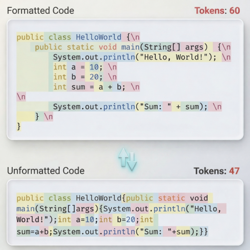

# Deblank 

> [!IMPORTANT]
> 🎉 This project originates from our **[ICSE'26 paper](https://arxiv.org/pdf/2508.13666)** and has received the **Distinguished Paper Award**.

**Deblank** is a powerful tool designed to optimize LLM efficiency by reducing the token count of source code through removing the optional formatting in the code. It acts as a bidirectional translation layer, compressing code into a compact, unformatted version for LLM processing and restoring it to a human-readable format for developers.


<p align="center">
  
</p>


## 📊 Why Deblank?

Our programming languages are mainly designed for human readability, where formatting is an essential part of the code.
However, when it comes to LLM interactions, we find that formatting becomes a barrier to token efficiency. 
By removing the optional formatting in the code, we can significantly reduce the token count, thereby improving the token efficiency of LLM interactions.
Most importantly, removing formatting does not affect the semantic meaning of the code.
Experiments on 10 different models including, DeepSeek-V3, Claude-3.7, and Gemini-1.5, show that removing formatting has negligible impact on Pass@1 performance for Fill-in-the-Middle code completion tasks. See our [ICSE'26 research paper](https://arxiv.org/pdf/2508.13666) for details.

Format removel can achieve the following token reduction for source code in our experiments (measured by GPT-4o's tokenizer):

| Language | Reduction |
|----------|-----------|
| Java     | 33.7%     |
| C#       | 26.2%     |
| C++      | 33.9%     |
| Python   | 9.4%      |

## 🚀 Features

- **Token Efficient:** Reduces tokens by ~15% for C-family languages and ~4% for Python while maintaining model performance.
- **Semantic Safety:** Ensures the Abstract Syntax Tree (AST) remains unchanged; only non-essential formatting (whitespace, indentation) is removed.
- **Lossless Round-trip:** Compresses code for the LLM and reformats the output back to industry-standard styles (PEP 8, Google Style) for humans.
- **Multi-Language Support:** Currently supports **Python**, **Java**, **C**, **C++**, **C#**, **JavaScript**, **TypeScript**, and **Go**.
- **High Performance:** Average transformation time of ~76ms per sample, suitable for real-time pipelines.
- **Easy Integration:** Accessible via a simple REST API.

---


## 🛠 Deployment

The core engine of Deblank is deployed as a service using Docker.

Before you begin, ensure you have Docker installed and running on your system. You can either pull the pre-built Docker image or build it from the source.

#### Step 1: Obtain the Image
**Pull the image:**
```bash
docker pull zhangcen456/deblank:latest
```
or

**Build from source:**
```bash
docker build -f dockerfile -t [image_name] .
```

#### Step 2: Run the Container
Once the image is ready, start the service by running:
```bash
docker run -d \
    -p [port_number]:5089 \
    -e ENABLE_GUESS_LANG=true \
    -e ENABLE_C_FAMILY=true \
    -e ENABLE_JS_TS=true \
    -e ENABLE_GO=true \
    [image_name]
```
The container is configured using environment variables to define supported features:
- `ENABLE_GUESS_LANG`: Set to `true` to enable automatically infer the programming language if not specified in the request.
- `ENABLE_C_FAMILY`: Set to `true` to enable support for Java, C, C++, and C#.
- `ENABLE_JS_TS`: Set to `true` to enable support for JavaScript and TypeScript.
- `ENABLE_GO`: Set to `true` to enable support for Go.


## 📝 Usage

Once the container is started, you can interact with Deblank through HTTP POST requests at localhost:[port_number].

Two endpoints are provided (respectively for unformatting the input and formatting the output):

1. `http://localhost:[port_number]/unformat_code`
2. `http://localhost:[port_number]/format_code`

### Input Format
For each endpoint, the input is a JSON object with the following fields:

- `input`: the text to be transformed by Deblank. It can be a pure code or code blocks mixed with natural language text. For the latter, the `start_tag` and `end_tag` are used to locate code blocks.
- `mode`: specifies how the input should be read. Set this to `code` for pure code and to `mixed` for text containing code blocks. Defaults to `mixed`.
- `language`: the language of the code. If not specified, we will try to infer the language from the code
- `repair_strategy`: specifies the recovery behavior when formatting tools fail.
    - `none`: Deblank will not attempt to fix syntax errors.
    - `on_failure`: If the initial formatting attempt fails, Deblank will try to repair the code.
- `config`: settings that define how code blocks are detected in `mixed` mode
    - `language_tag`: when set to true, Deblank looks for a language name immediately following the `start_tag`. If found, this detected language will override the upper-level `language` setting
    - `start_tag`: the start tag of the code block. Defaults to \```
    - `end_tag`: the end tag of the code block. Defaults to \```

### Output Format
The API returns a JSON object containing a `segments` list. Each segment represents a fragment of the input text, categorized by its `type`:
1. Text segments (`"type": "text"`) represents natural language fragments which are returned exactly as they appear in the input.
2. Code segments (`"type": "code"`) represents code snippets and contain:
- `content`: The processed code (formatted or unformatted based on the API used).
- `language`: The programming language used for processing, either provided in the input or inferred from the code.
- `meta_info`: Technical details regarding the transformation process:
  - `status`: Indicates the processing outcome.
    - `success`: The code is successfully processed.
    - `regex`: The primary formatting tool fails, and Deblank falls back to a heuristic, regex-based transformation.
    - `failed`: The transformation could not be performed. The `content` remain in its original state.
  - `repair_attempted`: A boolean value that indicates whether Deblank attempts to auto-fix syntax errors to satisfy the formatting tool.
  - `original_error`: The raw error message returned by the underlying formatting tool if a failure or fallback occurs.

### Examples

**Example Usage 1 (Python): Pure Code Mode**

```python
import requests

url = "http://localhost:[port_number]/unformat_code"

payload = {
    "input": "public class HelloWorld {\n    public static void main(String[] args) {\n        System.out.println(\"Hello, World!\");\n    }\n}",
    "mode": "code",
    "language": "java",
    "repair_strategy": "on_failure"
}

response = requests.post(url, json=payload)
print(response.json())
```

The response will be:
```json
{
  "segments": [
    {
      "type": "code",
      "content": "public class HelloWorld{public static void main(String[]args){System.out.println(\"Hello, World!\");}}",
      "language": "Java",
      "meta_info":{
        "status": "success",
        "repair_attempted": false,
        "original_error": null
      }
    }
  ]
}
```

**Example Usage 2 (Python): Mixed Mode**
```python
import requests

url = "http://localhost:[port_number]/unformat_code"

payload = {
    "input": "Here is the solution:```java\npublic class HelloWorld {\n    public static void main(String[] args) {\n        System.out.println(\"Hello, World!\");\n    }\n```",
    "mode": "mixed",
    "repair_strategy": "on_failure",
    "config": {
        "language_tag": True, 
        "start_tag":"```", 
        "end_tag":"```",
    }
}

response = requests.post(url, json=payload)
print(response.json())
```

The response will be:
```json
{
  "segments":[
    {
      "type": "text",
      "content": "Here is the solution:"
    },
    {
      "type": "code",
      "content": "public class HelloWorld{public static void main(String[]args){System.out.println(\"Hello, World!\");}",
      "language": "Java",
      "meta_info":{
        "status": "success",
        "repair_attempted": true,
        "original_error": "do_source_file: Parsing: <source_file> as language JAVA\nindent_text(4321): size is 2\nindent_text(4323): File: <source_file>, open_line is 1, parent is NONE: Unmatched BRACE_OPEN"
      }
    }
  ]
}
```

**Example Usage 3 (curl)**

Request body:
```json
//input.json
{
  "input": "function greet(name) {\n    console.log(\"Hello, \" + name);\n}",
  "mode": "code",
  "language": null,
  "repair_strategy": "on_failure"
}
```

Send the request using `curl`:
```bash
curl -X POST http://localhost:[port_number]/unformat_code \
  -H "Content-Type: application/json" \
  -d @input.json
```

The response will be:
```json
{
  "segments": [
    {
      "type": "code",
      "content": "function greet(name){console.log(\"Hello, \"+name)}",
      "language": "JavaScript",
      "meta_info": {
        "status": "success",
        "repair_attempted": false,
        "original_error": null
      }
    }
  ]
}
```
